<div align="center">

# NeuroGrid

### Privacy-aware intelligence for the energy grid, from one building to an entire city

[](https://github.com/fahaddubush/NeuroGrid/actions/workflows/ci.yml)
[](https://www.python.org/)
[](https://pytorch.org/)
[](https://spark.apache.org/)
[](#verification)
[](LICENSE)

**Spark ETL · CityLSTM forecasting · hierarchical federated learning · Byzantine resilience · local LLM advice**

</div>

---

NeuroGrid is a three-tier **Integrated Sensing, Memory, Computation, and Communication (ISMCC)** multi-agent system for smart-grid forecasting and coordination. Each building learns from its own meter stream; districts aggregate durable, privacy-conscious updates; and the city maintains the global model without centralizing household measurements.

> **Project status:** tested research implementation. The release is reproducible, while real utility deployment still requires production data, trained artifacts, infrastructure, and site-specific security configuration.

## At a glance

| Metric | Current release |
| --- | ---: |
| Automated tests | **153 passing** |
| Python source modules | **64** |
| System tiers | **3** |
| Forecast horizon | **96 × 15 min (24 hours)** |
| Primary transport | **gRPC + Protocol Buffers** |
| Durable state | **SQLite WAL** |
| License | **MIT** |

## System architecture

<p align="center">
  
</p>

| Tier | Sensing & memory | Computation | Communication & resilience |
| --- | --- | --- | --- |
| **Building** | Smart-meter stream, causal features, bounded memory | CityLSTM forecasting, online adaptation, battery scheduling, local Ollama advice | Masked Top-K updates, error feedback, optional round-level DP |
| **District** | Aggregated virtual sensors, durable pending journal | Clipping, Multi-Krum, masked trimmed mean | Concurrent gRPC ingestion, WAL transactions, durable City outbox |
| **City** | City-wide model history and convergence state | Coordinate-aware weighted aggregation and candidate acceptance | Transactional recovery, versioned global checkpoints |

The data plane turns raw 15-minute measurements into versioned Parquet datasets. The learning plane moves only bounded model updates through the hierarchy. The advice plane translates validated forecasts into optional natural-language recommendations without placing an LLM on the critical control path.

<details>
<summary><strong>Building agent: internal ISMCC loop</strong></summary>

<p align="center">
  
</p>

Every agent couples four capabilities: **Sensing** detects and contextualizes events, **Memory** retains bounded operational history, **Computation** forecasts and optimizes energy use, and **Communication** exchanges validated model updates.

</details>

## Why the engineering is interesting

### Federated learning that respects sparse updates

- Omitted Top-K coordinates travel with masks and are never averaged as real zeroes.
- Compression residuals use error feedback and survive until a successful round.
- Krum fails closed unless its mathematical requirement `n ≥ 2f + 3` is satisfied.
- Payloads are schema-hashed, versioned, tensor-count-limited, and size-limited.
- PyTorch payloads use restricted `weights_only=True` deserialization.

### Failure-aware distributed state

- District and City services persist state in WAL-backed SQLite transactions.
- Idempotency and durable outboxes make retries safe across process restarts.
- Versioned checkpoints prevent stale model updates from silently winning.
- Insecure gRPC is loopback-only; network deployments support mutual TLS and certificate-to-agent identity checks.

### Causal, model-safe data processing

- PySpark performs causal imputation rather than leaking future measurements backward.
- Timezones and daylight-saving transitions are explicit.
- Weather joins, missingness indicators, and finite-value checks prevent silent NaN poisoning.
- ETL publishes atomically through a `CURRENT` pointer, so an incomplete run cannot replace the last valid dataset.

### LLM advice outside the control loop

The Ollama recommender is optional and non-blocking. Timeouts, malformed responses, or unavailable local models fall back to deterministic advice; generated text cannot directly operate grid equipment.

## Repository map

```text
NeuroGrid/
├── src/
│   ├── data/          # Spark ETL, feature schema, dataset and weather pipeline
│   ├── federated/     # clipping, accounting, sparsification and robust aggregation
│   ├── ismcc/          # sensing, memory, computation and secure communication
│   ├── llm/           # bounded local Ollama recommender
│   ├── models/        # CityLSTM and safe artifact bundles
│   ├── tiers/         # Building, District and City services
│   ├── training/      # training, curriculum, evaluation and Spark DDP
│   └── simulation/    # hierarchical simulations and scenario reports
├── tests/             # numerical, concurrency, persistence and integration tests
├── docs/architecture/ # system diagrams and detailed operational flows
├── proto/             # canonical gRPC service definition
└── scripts/           # workspace cleanup and release verification
```

Generated outputs belong under `artifacts/`, raw datasets under `data/raw/`, and trained runs under `src/models/stored/`. They are intentionally excluded from Git.

## Quick start

### Prerequisites

- Python **3.11**
- Java **17** for PySpark
- Optional: [Ollama](https://ollama.com/) for local natural-language recommendations

```bash
git clone https://github.com/fahaddubush/NeuroGrid.git
cd NeuroGrid

python -m venv .venv
source .venv/bin/activate            # Windows: .venv\Scripts\activate
python -m pip install -r requirements-dev.txt
cp .env.example .env                 # Windows: copy .env.example .env
```

Set `HEAPO_DATA_DIR` to the directory containing the HEAPO 15-minute meter data. Windows Spark installations also require a compatible Hadoop helper through `HADOOP_HOME`; platform binaries are deliberately not vendored.

## End-to-end workflow

| Stage | Command | Result |
| ---: | --- | --- |
| 1 | `python -m src.cli sample-households --target_n 30 --k 3 --seed 0` | Reproducible representative cohort |
| 2 | `python -m src.cli etl --household_manifest artifacts/sampling/<run_id>/manifest.json --source_timezone Europe/Helsinki` | Causal, versioned Parquet dataset |
| 3 | `python -m src.cli forecast-daily --manifest_path artifacts/sampling/<run_id>/manifest.json --output_dir src/models/stored/forecast_daily --epochs 10` | Trained 24-hour CityLSTM bundle |
| 4 | `python -m src.cli evaluate --run_dir src/models/stored/forecast_daily --manifest_path artifacts/sampling/<run_id>/manifest.json --split test` | Held-out evaluation report |
| 5 | `python -m src.cli simulate --num_agents 9 --num_districts 3 --ticks 200 --pred_len 4 --teacher_run src/models/stored/forecast_daily --scenario baseline` | Three-tier simulation artifacts |

The official daily forecasting path maps **96 historical 15-minute steps** to the **next 96 steps**. Model bundles contain a restricted `model.pth`, safe `scaler.npz`, configuration, checksums, and provenance. A valid City teacher baseline is required before federated delta rounds are accepted.

## Verification

Run the same gates used by continuous integration:

```bash
python scripts/verify_release.py
python -m ruff check --select E9,F63,F7,F82 src tests scripts
python -m pytest -q -p no:cacheprovider
python -m pip check
```

The suite covers tensor-shape and numerical edge cases, masked aggregation, DP accounting, payload validation, concurrent gRPC ingestion, SQLite recovery, ETL causality, timezone handling, LLM fallback behavior, and end-to-end tier integration.

## Secure deployment

Local development binds to `127.0.0.1`. For a networked deployment, enable TLS and supply deployment-specific identities:

```dotenv
NEUROGRID_TLS=1
NEUROGRID_BIND_HOST=0.0.0.0
NEUROGRID_CA_CERT=/secure/ca.pem
NEUROGRID_SERVER_CERT=/secure/server.pem
NEUROGRID_SERVER_KEY=/secure/server-key.pem
NEUROGRID_CLIENT_CERT=/secure/client.pem
NEUROGRID_CLIENT_KEY=/secure/client-key.pem
NEUROGRID_ALLOWED_AGENTS=Bldg_001,Bldg_002,District_01
```

Use separate certificates whose common name or subject alternative name equals the agent ID. Never commit credentials, household data, `.env`, runtime databases, or trained artifacts. The precise trust boundaries and non-claims are documented in [SECURITY.md](SECURITY.md); NeuroGrid does **not** claim cryptographic secure aggregation or per-example DP-SGD.

## Documentation

| Document | Purpose |
| --- | --- |
| [System tiers](docs/architecture/system-tiers.md) | ISMCC responsibilities at Building, District, and City scale |
| [Operational flow](docs/architecture/operational-flow.md) | Full sense → learn → aggregate → distribute lifecycle |
| [ISMCC agent model](docs/architecture/ismcc-agent-model.md) | Internal cognitive-agent design and module couplings |
| [Spark federation guide](docs/guides/spark-federation.md) | Batch federation through Spark and TorchDistributor |
| [Technical report](docs/research/technical-report.md) | Research motivation, methodology, and system boundaries |
| [Security policy](SECURITY.md) | Threat boundaries, deployment assumptions, and reporting |
| [Contributing guide](CONTRIBUTING.md) | Development workflow and quality gates |

## Responsible scope

NeuroGrid is research software for forecasting, coordination, and simulation. It is not a certified utility control system, safety controller, or guarantee of privacy. Operational deployment requires independent security review, calibrated privacy parameters, trained model validation, monitoring, and compliance with local energy and data-protection requirements.

## License

Released under the [MIT License](LICENSE).

<div align="center">

Built to explore how private local learning can become reliable city-scale intelligence.

</div>
